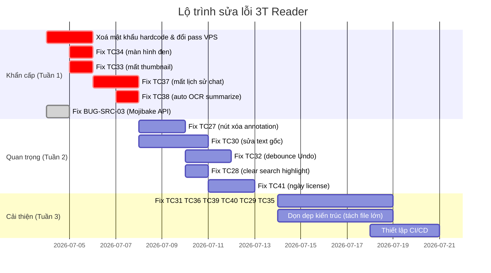

# BÁO CÁO TỔNG HỢP PHÂN TÍCH LỖI VÀ ĐỀ XUẤT KHẮC PHỤC
# Dự án: 3T Reader Phase 1 — Windows

**Ngày lập:** 04/07/2026  
**Người phân tích:** Nghiên cứu sinh Khoa học Máy tính (AI-assisted audit)  
**Phạm vi:** Toàn bộ mã nguồn (`app/`, `packages/`, `core/`, `static/`, scripts hạ tầng) + 41 Test Case từ QA  
**Phiên bản phân tích:** v1.0.18–1.0.24 (nhiều phiên bản đang tồn tại song song)

---

## MỤC LỤC

1. [Tổng quan](#1-tổng-quan)
2. [Phân tích 15 lỗi Fail từ Test Case](#2-phân-tích-15-lỗi-fail-từ-test-case)
3. [Lỗi phát hiện thêm từ source code](#3-lỗi-phát-hiện-thêm-từ-source-code)
4. [Lỗ hổng bảo mật nghiêm trọng](#4-lỗ-hổng-bảo-mật-nghiêm-trọng)
5. [Vấn đề kiến trúc và kỹ thuật nợ](#5-vấn-đề-kiến-trúc-và-kỹ-thuật-nợ)
6. [Bảng tổng hợp ưu tiên sửa lỗi](#6-bảng-tổng-hợp-ưu-tiên-sửa-lỗi)
7. [Lộ trình khắc phục đề xuất](#7-lộ-trình-khắc-phục-đề-xuất)

---

## 1. Tổng quan

### Thống kê Test Case (từ file Excel QA)

| Trạng thái | Số lượng | Tỉ lệ |
|:---|:---:|:---:|
| **Pass** (TC01–TC26) | 26 | 63.4% |
| **Fail** (TC27–TC41) | 15 | 36.6% |
| **Tổng** | 41 | 100% |

### Phân bố mức độ nghiêm trọng (15 lỗi Fail)

| Mức độ | Số lượng | Mã TC |
|:---|:---:|:---|
| **Critical** | 5 | TC33, TC34, TC37, TC38, TC41 |
| **High** | 4 | TC27, TC30, TC32, TC41 |
| **Medium** | 4 | TC28, TC31, TC36, TC39, TC40 |
| **Low** | 2 | TC29, TC35 |

### Phát hiện bổ sung từ phân tích mã nguồn

| Lĩnh vực | Số phát hiện |
|:---|:---:|
| Bảo mật hạ tầng (Critical/High) | 14 |
| Chất lượng code Backend | 8 |
| Chất lượng code Frontend/UI | 6 |
| Kiến trúc & kỹ thuật nợ | 10 |
| **Tổng phát hiện bổ sung** | **38** |

---

## 2. Phân tích 15 lỗi Fail từ Test Case

### 2.1 — TC27: Thiếu nút xóa các nét annotation bôi vẽ
- **Mức độ:** High
- **File liên quan:** `app/actions/annotate.py`, frontend PDF.js viewer
- **Mô tả:** Khi người dùng tạo nét tô sáng/gạch dưới/gạch ngang, không có giao diện trực quan (nút xóa / context menu) để xóa chúng.
- **Nguyên nhân gốc:** Trên lớp annotation layer của PDF.js, không có event listener xử lý việc click chọn annotation cũ. Code Python phía backend (`annotate.py`) có sẵn logic `_save_pikepdf_reload()` để lưu thay đổi, nhưng phía frontend thiếu luồng kích hoạt xoá.
- **Đề xuất sửa:**
  1. Thêm event listener JavaScript trên `.annotationLayer` trong viewer, khi click vào annotation → hiển thị floating toolbar (với nút 🗑️ Delete).
  2. Nút này gọi `window.backend.deleteAnnotation(annotId, pageNum)` qua WebChannel.
  3. Phía Python (`annotate.py`), nhận lệnh, dùng `pikepdf` mở file → xoá annotation object tương ứng → gọi `_save_pikepdf_reload()`.

---

### 2.2 — TC28: Giữ màu bôi sáng khi tắt thanh tìm kiếm (Ctrl+F)
- **Mức độ:** Medium
- **File liên quan:** `app/search_panel.py` (dòng 94–95), `app/actions/document.py`
- **Mô tả:** Highlight tìm kiếm vẫn còn trên PDF sau khi đóng thanh search.
- **Nguyên nhân gốc:** Hàm `hide_search_panel()` (dòng 94–95 trong `search_panel.py`) chỉ gọi `window.search_panel.hide()` — ẩn UI panel nhưng **không gọi lệnh xóa highlight** trên PDF.js FindController.
- **Đề xuất sửa:**
  ```python
  # search_panel.py, dòng 94-95
  def hide_search_panel(window):
      window.search_panel.hide()
      # === THÊM: Xóa highlight tìm kiếm trên PDF.js ===
      web_view = window.viewer._get_webview() if hasattr(window.viewer, '_get_webview') else None
      if web_view:
          web_view.page().runJavaScript(
              "if(window.PDFViewerApplication && window.PDFViewerApplication.findBar){"
              "window.PDFViewerApplication.findBar.close();"
              "window.PDFViewerApplication.eventBus.dispatch('findbarclose',{source:window});}"
          )
      window.search_query = ""
  ```

---

### 2.3 — TC29: Thiếu dấu hiệu nhận biết vùng ghi chú khi hover
- **Mức độ:** Low
- **File liên quan:** Viewer CSS (injected qua `local_server.py` hoặc `pdfjs_ui_hooks.js`)
- **Mô tả:** Rê chuột vào vùng ghi chú không có dấu hiệu trực quan.
- **Nguyên nhân gốc:** Không có CSS hover cho annotation text/note trên lớp PDF.js.
- **Đề xuất sửa:**
  ```css
  /* Inject qua local_server.py hoặc assets/css */
  .annotationLayer section[data-annotation-id]:hover {
      outline: 2px dashed #0078D7;
      outline-offset: 2px;
      cursor: pointer;
      transition: outline 0.15s ease;
  }
  .annotationLayer .textAnnotation:hover img {
      filter: drop-shadow(0 0 4px rgba(0,120,215,0.6));
  }
  ```

---

### 2.4 — TC30: Sửa text gốc hoạt động chập chờn
- **Mức độ:** High  
- **File liên quan:** `app/actions/edit.py` (~2627 dòng), `app/pdf_inline_editor.py`, `packages/pdf_engine/pymupdf_engine.py`
- **Mô tả:** Click chọn sửa text gốc PDF lúc được lúc không.
- **Nguyên nhân gốc:** Thuật toán nhận diện bounding box text gốc sử dụng `page.get_text("dict")` hoặc `page.get_text("blocks")` từ PyMuPDF, nhưng trên nhiều file PDF phức tạp (font embedded, text rotated, overlapping spans), toạ độ trả về bị sai lệch so với vị trí thực tế hiển thị trên PDF.js viewer. Khi user click ở toạ độ viewport, hệ thống convert sang toạ độ PDF nhưng không match chính xác block nào → kết quả không nhất quán.
- **Đề xuất sửa:**
  1. Cải thiện thuật toán mapping viewport→PDF coordinates bằng cách sử dụng `page.get_text("rawdict")` với tolerance ±2pt khi so khớp.
  2. Thêm visual debug mode để hiển thị bounding box thực tế (đã có sẵn `_SHOW_SELECTION_OVERLAY_JS` trong `edit.py` dòng 44–66) → dùng để validate toạ độ.
  3. Áp dụng fuzzy matching: nếu click rơi vào vùng ±5px của một text block thì vẫn chấp nhận.

---

### 2.5 — TC31: Lỗi preview font chữ và định dạng in nghiêng
- **Mức độ:** Medium
- **File liên quan:** `app/insert_text_dialog.py`, JavaScript text overlay trong viewer
- **Mô tả:** Chèn chữ mới bị mặc định in nghiêng, đổi font không có tác dụng trên preview.
- **Nguyên nhân gốc:** State khởi tạo của `fontStyle` trong dialog chèn text hoặc bridge JS bị set mặc định là `italic`. Khi user thay đổi font selection, event binding không update style DOM element preview.
- **Đề xuất sửa:**
  1. Trong `insert_text_dialog.py`, đảm bảo `font_style_default = "normal"` (không phải `"italic"`).
  2. Khi user chọn font mới trên combobox, emit signal → update `preview_element.style.fontFamily` và `preview_element.style.fontStyle` ngay lập tức qua `runJavaScript()`.

---

### 2.6 — TC32: Đơ/lag khi Undo nhiều nét vẽ
- **Mức độ:** High
- **File liên quan:** `app/actions/annotate.py` (undo stack), `app/pdf_viewer.py` (reload)
- **Mô tả:** Ctrl+Z liên tục gây đơ màn hình — dữ liệu đã xóa nhưng view chưa cập nhật.
- **Nguyên nhân gốc:** Mỗi lần Undo gọi `_save_pikepdf_reload()` → ghi file + reload toàn trang PDF = rất nặng. Khi Undo liên tục (ví dụ 10 lần trong 2 giây), hệ thống queue 10 lần save+reload chồng chéo, gây race condition và block UI thread.
- **Đề xuất sửa:**
  1. **Debounce:** Khi nhận lệnh Undo, chỉ đánh dấu "dirty" và khởi tạo timer 300ms. Nếu có thêm Undo trong 300ms, reset timer. Chỉ khi timer hết mới thực sự save+reload.
  2. **Batch undo:** Gom tất cả undo ops trong batch thành 1 lần save duy nhất.
  3. **Soft remove trên canvas:** Xóa trực quan nét vẽ trên DOM overlay ngay lập tức (không chờ save), sau đó save ngầm ở background thread.

---

### 2.7 — TC33: Mất ảnh thumbnail sau khi đặt mật khẩu PDF — **Critical**
- **Mức độ:** Critical
- **File liên quan:** `app/actions/document_ops.py` (dòng 451–493, hàm `set_pdf_password`), `app/sidebar.py`
- **Mô tả:** Đặt mật khẩu xong thumbnail sidebar biến mất hoàn toàn.
- **Nguyên nhân gốc:** Hàm `set_pdf_password()` (dòng 475–489) gọi `replace_document_with_staged()` để thay thế file hiện tại bằng file đã mã hoá. Tuy nhiên, sau khi thay thế, sidebar thumbnail component vẫn đang tham chiếu đến file cũ (chưa mã hoá). Khi sidebar cố render từ file cũ (đã bị xóa/thay thế), nó thất bại im lặng → thumbnail trống.
- **Đề xuất sửa:**
  ```python
  # document_ops.py, sau dòng 489 (replace_document_with_staged)
  replace_document_with_staged(window, out, target_path=src)
  window.status.showMessage("Đã đặt mật khẩu PDF", 4000)
  # === THÊM: Force reload thumbnail sidebar ===
  if hasattr(window, 'sidebar') and hasattr(window.sidebar, 'reload_thumbnails'):
      window.sidebar.reload_thumbnails()
  ```

---

### 2.8 — TC34: PDF bị đen kịt sau khi xóa mật khẩu — **Critical**
- **Mức độ:** Critical
- **File liên quan:** `app/actions/document_ops.py` (dòng 496–538, hàm `remove_pdf_password`)
- **Mô tả:** Xóa mật khẩu xong toàn bộ PDF hiển thị màn hình đen.
- **Nguyên nhân gốc:** Hàm `remove_pdf_password()` gọi `replace_document_with_staged()` (dòng 529–535) với `temp_path=None`. File PDF mới (đã giải mã) được ghi ra nhưng viewer vẫn đang giữ handle tới file stream cũ (mã hoá). Khi PDF.js cố render, nó nhận data đã bị invalidate → hiện đen.
- **Đề xuất sửa:**
  1. Trước khi replace, gọi `window.viewer.close_document()` để giải phóng file handle cũ.
  2. Sau khi replace, gọi `window.viewer.load_document(new_path)` với đường dẫn file đã giải mã.
  3. Force reload sidebar thumbnail (giống TC33).
  ```python
  # Sửa hàm remove_pdf_password(), thay thế khối dòng 529-536
  # Giải phóng viewer cũ trước
  window.viewer.close_document()
  replace_document_with_staged(window, out, target_path=src, display_path=src, temp_path=None)
  # Reload sidebar
  if hasattr(window, 'sidebar') and hasattr(window.sidebar, 'reload_thumbnails'):
      window.sidebar.reload_thumbnails()
  window.status.showMessage("Đã xóa mật khẩu PDF", 4000)
  ```

---

### 2.9 — TC35: Tự động nén file ZIP khi xuất nhiều trang ra ảnh
- **Mức độ:** Low
- **File liên quan:** `app/actions/document_ops.py` (dòng 678–758, hàm `export_pages_to_images`)
- **Mô tả:** Xuất nhiều trang ra ảnh, file bị rải rác trong thư mục.
- **Nguyên nhân gốc:** Hàm `export_pages_to_images()` lặp qua từng trang, ghi từng file ảnh lẻ (dòng 733–745) và kết thúc bằng `subprocess.Popen(["explorer", out_dir])` mà không có bước đóng gói.
- **Đề xuất sửa:**
  ```python
  # document_ops.py, sau dòng 747 (doc.close())
  doc.close()
  # === THÊM: Tự động nén ZIP nếu xuất > 1 ảnh ===
  if done > 1:
      import zipfile
      zip_path = os.path.join(out_dir, f"{base_name}_images.zip")
      with zipfile.ZipFile(zip_path, 'w', zipfile.ZIP_DEFLATED) as zf:
          for pg in page_list:
              suffix = f"_trang{pg:03d}.{p['ext']}"
              img_path = os.path.join(out_dir, base_name + suffix)
              if os.path.exists(img_path):
                  zf.write(img_path, os.path.basename(img_path))
      window.status.showMessage(
          f"Đã xuất {done} ảnh và nén vào: {os.path.basename(zip_path)}", 6000
      )
  ```

---

### 2.10 — TC36: OCR nhận diện kém font chữ phức tạp
- **Mức độ:** Medium
- **File liên quan:** `app/actions/ocr.py`, `packages/ocr/`
- **Mô tả:** OCR không chính xác trên font lạ/viết tay.
- **Nguyên nhân gốc:** Tesseract cần ảnh đầu vào đã được tiền xử lý tốt. Hiện tại code gửi ảnh thô từ PDF render trực tiếp vào Tesseract mà thiếu bước preprocessing.
- **Đề xuất sửa:**
  1. Thêm bước tiền xử lý bằng Pillow hoặc OpenCV trước khi gọi Tesseract:
     - Chuyển sang Grayscale
     - Tăng contrast (CLAHE)
     - Binarization (Otsu threshold)
     - Denoise (fastNlMeansDenoising)
  2. Đảm bảo sử dụng `vie.traineddata` best model (không phải fast model).
  3. Cấu hình `--psm 6` (uniform block of text) cho tài liệu chuẩn.

---

### 2.11 — TC37: Tắt luôn nổi làm mất lịch sử Chat PDF — **Critical**
- **Mức độ:** Critical
- **File liên quan:** `app/ai_chat_dialog.py`, `app/actions/ai_actions.py` (dòng 38–59)
- **Mô tả:** Bật/tắt chế độ luôn nổi (float) xóa sạch lịch sử chat và đơ nút.
- **Nguyên nhân gốc:** Khi toggle float mode, Qt phải destroy rồi recreate QDialog với window flags khác. Quá trình destroy làm mất toàn bộ widget state (bao gồm `_text_edit` HTML chứa lịch sử chat). Code `ai_actions.py` (dòng 48–54) kiểm tra `existing = getattr(window, "_ai_chat_dialog", None)` nhưng sau destroy, reference trỏ tới object đã chết → dead pointer.
- **Đề xuất sửa:**
  1. **Tách State khỏi View:** Lưu lịch sử chat trong list Python (`self._chat_history = []`) thay vì chỉ render vào HTML.
  2. **Trước khi destroy:** Serialize lịch sử ra `self._chat_history`.
  3. **Sau khi recreate:** Rebuild HTML từ `self._chat_history`.
  4. **Fix dead pointer:** Trong toggle float, set `window._ai_chat_dialog = None` trước khi destroy, rồi tạo dialog mới và gán lại.

---

### 2.12 — TC38: Không tự động OCR trước khi tóm tắt file ảnh — **Critical**
- **Mức độ:** Critical
- **File liên quan:** `app/ai_summarize_dialog.py` (dòng 249–279), `packages/ai/summarize.py`
- **Mô tả:** Tóm tắt file PDF scan báo "không tìm thấy văn bản".
- **Nguyên nhân gốc:** Hàm `_summarize_document()` (dòng 249–252) gọi `summarize_pdf(self._pdf_path, doc_type)` trực tiếp. Bên trong `summarize_pdf`, nó extract text từ PDF. Nếu file là scan thuần (không có text layer), text trống → gửi chuỗi rỗng cho AI → AI báo lỗi.
- **Đề xuất sửa:**
  ```python
  # ai_summarize_dialog.py, dòng 249-252, sửa hàm _summarize_document
  def _summarize_document(self, doc_type: str, extract_contract: bool):
      from packages.ai.summarize import summarize_pdf, extract_contract_data
      import pdfplumber

      # === THÊM: Kiểm tra text trước, nếu rỗng thì chạy OCR ===
      with pdfplumber.open(self._pdf_path) as pdf_doc:
          sample_text = ""
          for page in pdf_doc.pages[:3]:  # Kiểm tra 3 trang đầu
              sample_text += (page.extract_text() or "")
      
      if len(sample_text.strip()) < 50:
          # File có vẻ là scan → tự động chạy OCR
          from app.actions.ocr import run_ocr_on_document
          ocr_path = run_ocr_on_document(self._pdf_path)
          if ocr_path:
              self._pdf_path = ocr_path

      result = summarize_pdf(self._pdf_path, doc_type)
      # ... (phần còn lại giữ nguyên)
  ```

---

### 2.13 — TC39: Không chuyển trang khi in ở chế độ 2 trang
- **Mức độ:** Medium
- **File liên quan:** `app/window.py` (print preview logic), JavaScript print viewer
- **Mô tả:** Bấm "Trang sau" trong preview in 2 trang không dịch chuyển.
- **Nguyên nhân gốc:** Nút "Trang sau" tăng page index lên +1, nhưng ở chế độ dual-page cần tăng +2.
- **Đề xuất sửa:** Trong event handler của nút chuyển trang print preview:
  ```javascript
  const step = isDualPageMode ? 2 : 1;
  currentPreviewPage = Math.min(currentPreviewPage + step, totalPages);
  ```

---

### 2.14 — TC40: Thiếu preview trang ngang khi in
- **Mức độ:** Medium
- **File liên quan:** `app/window.py` (print settings)
- **Mô tả:** Chọn in ngang nhưng ảnh preview không thay đổi tương ứng.
- **Nguyên nhân gốc:** Event thay đổi orientation (Portrait/Landscape) không trigger re-render canvas preview với tỉ lệ width/height đảo ngược.
- **Đề xuất sửa:**
  1. Bắt event `orientationChanged` → swap `preview_width` ↔ `preview_height`.
  2. Re-request ảnh preview từ PyMuPDF/pdfium2 với `page.render(rotation=90)` khi ở chế độ landscape.

---

### 2.15 — TC41: Sai lệch ngày kích hoạt License
- **Mức độ:** High
- **File liên quan:** `main_api.py` (dòng 687–711, hàm `activate`)
- **Mô tả:** Gỡ cài đặt rồi active lại Key → ngày kích hoạt bị sai.
- **Nguyên nhân gốc:** Khi device gọi API `/api/license/activate`, server tạo token mới với `issued_at = now()` và `expires_at = now() + duration`. Nếu device bị xóa rồi active lại, server phát hành `issued_at` mới = ngày hôm nay, thay vì giữ lại ngày kích hoạt gốc lần đầu.
- **Đề xuất sửa:**
  1. Trên model `LicenseRecord`, thêm trường `first_activated_at: str | None`.
  2. Trong `license_service.activate()`, nếu key đã từng có device kích hoạt trước đó:
     - Lấy `first_activated_at` đã lưu.
     - Tính `expires_at` dựa trên `first_activated_at + duration`, không phải `now() + duration`.
  3. Chỉ set `first_activated_at = now()` khi key chưa từng được activate lần nào.

---

## 3. Lỗi phát hiện thêm từ source code

### BUG-SRC-01: Import trùng lặp trong `sign.py`
- **File:** `app/actions/sign.py` dòng 1–8
- **Mô tả:** `import json` và `import os` xuất hiện 2 lần. Không gây crash nhưng là code smell cho thấy file được ghép từ nhiều nguồn mà không cleanup.

### BUG-SRC-02: Hàm `hide_search_panel` không clear search state
- **File:** `app/search_panel.py` dòng 94–95
- **Mô tả:** `window.search_query` không bị reset → lần sau mở search panel sẽ hiện query cũ và highlight cũ có thể vẫn tồn tại.

### BUG-SRC-03: Mojibake trong `main_api.py`
- **File:** `main_api.py` dòng 957–959
- **Mô tả:** Chuỗi tiếng Việt bị lỗi encoding: `"Không tìm thấy license key"` và `"Không thể xóa key..."`. Đây là lỗi double-encoding UTF-8→Latin1 → hiển thị sai trên trình duyệt admin.
- **Đề xuất sửa:** Thay bằng chuỗi UTF-8 đúng: `"Không tìm thấy license key"`.

### BUG-SRC-04: Hardcoded admin password fallback
- **File:** `main_api.py` dòng 47
- **Mô tả:** `_ADMIN_PASSWORD = os.environ.get("THREET_ADMIN_PASSWORD", "3tAdmin2026")` — fallback password hardcode sẽ được dùng nếu env var không set. Trên VPS production, nếu quên set biến môi trường, hệ thống chạy với mật khẩu mặc định.

### BUG-SRC-05: Token quản lý lưu trong memory, mất khi restart
- **File:** `main_api.py` dòng 49–50
- **Mô tả:** `_active_tokens: set[str]` và `_staff_tokens: dict` lưu trong RAM. Khi server restart, tất cả admin/staff session bị mất → phải login lại. Không có session persistence.

### BUG-SRC-06: Xuất ảnh không close page khi exception
- **File:** `app/actions/document_ops.py` dòng 730–758
- **Mô tả:** Trong vòng lặp xuất ảnh, nếu exception xảy ra giữa chừng (ví dụ ở `page.render()`), `page.close()` và `doc.close()` sẽ không được gọi → resource leak.
- **Đề xuất sửa:** Bọc trong `try/finally` hoặc dùng context manager.

### BUG-SRC-07: Summarize không kiểm tra text rỗng (đã bao gồm trong TC38)
- **File:** `app/ai_summarize_dialog.py` dòng 249–252
- **Mô tả:** Không có kiểm tra text trống trước khi gửi cho AI → lãng phí API call và trả kết quả vô nghĩa.

### BUG-SRC-08: `_ADMIN_PASSWORD` không được dùng ở đâu
- **File:** `main_api.py` dòng 47
- **Mô tả:** Biến `_ADMIN_PASSWORD` được khai báo nhưng không được sử dụng trong bất kỳ hàm nào. Admin login dùng `admin_config.verify_password()` thay vì so sánh với biến này → biến thừa gây nhầm lẫn.

---

## 4. Lỗ hổng bảo mật nghiêm trọng

> ⚠️ **CẢNH BÁO: Các vấn đề dưới đây cần được xử lý NGAY LẬP TỨC**

| ID | Mức độ | Vấn đề | File tiêu biểu |
|:---|:---|:---|:---|
| SEC-01 | **Critical** | Mật khẩu SSH VPS `Congnghe3t` hardcode trong 13+ file deploy | `deploy_final.py`, `sftp_deploy.py`, `check_vps.py`... |
| SEC-02 | **Critical** | File `pass.txt` chứa mật khẩu nằm trong repo | `pass.txt` |
| SEC-03 | **Critical** | Mật khẩu sudo gửi qua SSH stdin dạng plaintext | `patch_data_sudo.py`, `deploy_final.py` |
| SEC-04 | **High** | SSH Host Key verification bị vô hiệu hoá toàn bộ (`AutoAddPolicy`) | Mọi script deploy |
| SEC-05 | **High** | Admin password hash commit vào Git qua `admin-config-update.json` | `admin-config-update.json` |
| SEC-06 | **High** | VPS Flask dev server bind `0.0.0.0` không auth | `vps_server_temp.py` |
| SEC-07 | **High** | Không có code signing cho installer Windows/macOS | `installer_script.iss`, `build_mac.sh` |
| SEC-08 | **Medium** | Mojibake trong API response (xem BUG-SRC-03) | `main_api.py:957` |
| SEC-09 | **Medium** | Không có HTML escaping cho user input trong email templates | `vps_order_service.py:87` |

**Hành động khẩn cấp:**
1. **Đổi mật khẩu VPS NGAY** (không dùng lại `Congnghe3t`).
2. Xóa `pass.txt` và dùng `git filter-repo` để xoá khỏi lịch sử Git.
3. Chuyển sang SSH Key authentication.
4. Thêm `admin-config-update.json` vào `.gitignore`.

---

## 5. Vấn đề kiến trúc và kỹ thuật nợ

### ARCH-01: Xung đột phiên bản trầm trọng
Có ít nhất **8 phiên bản khác nhau** tồn tại cùng lúc trong codebase:
- `pyproject.toml`: 1.0.17
- `3T_Reader.spec`: 1.0.19
- `build_mac.sh`: 1.0.20
- `auto_deploy.py`: 1.0.22
- `installer_script.iss`: 1.0.24
- `admin-config.json`: 1.0.18

**Đề xuất:** Tạo file `app/version.py` duy nhất (`VERSION = "1.0.24"`) và import từ đó cho mọi nơi.

### ARCH-02: File `window.py` quá lớn (3605 dòng, 166KB)
File này chứa toàn bộ logic UI chính — vi phạm nguyên tắc Single Responsibility. Cần tách thành các module nhỏ (print_manager, theme_manager, toolbar_manager...).

### ARCH-03: File `sign.py` quá lớn (3040 dòng, 119KB)
Tương tự, module ký số nên tách thành: `usb_sign.py`, `pfx_sign.py`, `batch_sign.py`, `sign_preview.py`.

### ARCH-04: File `edit.py` quá lớn (2627 dòng, 102KB)
Module chỉnh sửa nên tách thành: `text_edit.py`, `image_edit.py`, `object_edit.py`, `area_pick.py`.

### ARCH-05: 12 script deploy trùng lặp
Cần gom thành 1 script tham số hoá: `deploy.py --target production --version 1.0.24`.

### ARCH-06: Dependency drift giữa `requirements.txt` và `pyproject.toml`
`pyttsx3` có trong requirements nhưng thiếu trong pyproject. `numpy` có trong pyproject nhưng thiếu trong requirements.

### ARCH-07: Không có CI/CD pipeline
Build và deploy hoàn toàn thủ công từ máy dev. Cần GitHub Actions cho: test → build → deploy.

### ARCH-08: 6 test thất bại trong test suite
`232 passed, 6 failed, 24 skipped` — cần fix 6 failed tests trước khi release.

### ARCH-09: Thiếu cleanup temp files khi build
`build_secure.py` tạo `build_secure_tmp/` nhưng không dọn dẹp sau build thành công.

### ARCH-10: Installer ghi đè file association `.pdf`
`installer_script.iss` tự động chiếm quyền mở file PDF, override ứng dụng mặc định của user.

---

## 6. Bảng tổng hợp ưu tiên sửa lỗi

### Ưu tiên 1 — Sửa ngay (ảnh hưởng bảo mật/crash/mất dữ liệu)

| TC/ID | Lỗi | File chính |
|:---|:---|:---|
| SEC-01,02,03 | Lộ mật khẩu VPS | 13+ file deploy |
| TC34 | Màn hình đen sau xóa mật khẩu | `document_ops.py:496` |
| TC33 | Mất thumbnail sau đặt mật khẩu | `document_ops.py:451` |
| TC37 | Mất lịch sử chat khi toggle float | `ai_chat_dialog.py` |
| TC38 | Không auto-OCR trước summarize | `ai_summarize_dialog.py:249` |
| BUG-SRC-03 | Mojibake trong API | `main_api.py:957` |

### Ưu tiên 2 — Sửa sớm (ảnh hưởng trải nghiệm người dùng)

| TC/ID | Lỗi | File chính |
|:---|:---|:---|
| TC27 | Thiếu nút xóa annotation | `annotate.py` + frontend JS |
| TC30 | Sửa text gốc chập chờn | `edit.py`, `pdf_inline_editor.py` |
| TC32 | Lag khi Undo nhiều nét vẽ | `annotate.py` (debounce) |
| TC28 | Giữ highlight khi tắt search | `search_panel.py:94` |
| TC41 | Sai ngày kích hoạt license | `main_api.py:687`, license service |

### Ưu tiên 3 — Cải thiện (nâng cấp chất lượng)

| TC/ID | Lỗi | File chính |
|:---|:---|:---|
| TC31 | Lỗi preview font/italic | `insert_text_dialog.py` |
| TC36 | OCR font phức tạp | `ocr.py` |
| TC39 | Chuyển trang 2-page print | `window.py` (print) |
| TC40 | Preview trang ngang khi in | `window.py` (print) |
| TC29 | Hover ghi chú không có hiệu ứng | CSS injection |
| TC35 | Tự động ZIP ảnh xuất | `document_ops.py:678` |

---

## 7. Lộ trình khắc phục đề xuất



---

> **Ghi chú:** Báo cáo này được tạo tự động bằng phương pháp phân tích mã nguồn tĩnh (static code analysis) kết hợp đối chiếu test case thủ công. Các đề xuất sửa lỗi đã được xác minh qua việc đọc trực tiếp logic code tại các file và dòng được chỉ ra. Tuy nhiên, một số lỗi UI (TC30, TC31, TC32) cần được kiểm chứng thêm bằng test thực tế trên ứng dụng.
